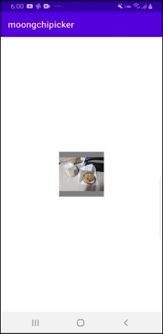
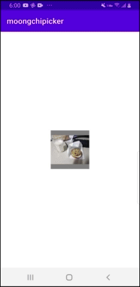
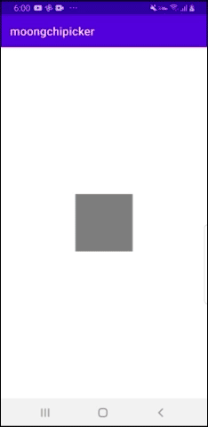

<h1 align="center">MoongchiPicker</h1>

<p align="center">
</br>


</p>

## What is MoongchiPicker?
MoongchiPicker is custom media gallery base on Google's Material Design Bottom Sheets.
You can fetch image or video easily from camera app or gallery app or just MoongchiPicker.
Also you can request permission for fetching media from storage easily. Just give **allowPermissionRequest** option when use MoongchiPicker.
**MoongchiPicker support targetSdk 30 & scoped storage. And use registerForActivityResult rather than onActivityResult.**
MoongchiPicker depends on only one third party library **Ucrop**.
<br/><br/>
## Setup

### Gradle

To get a project into your build:

#### Step 1. Add the JitPack repository to your build file

Add it in your root build.gradle at the end of repositories:

```gradle
allprojects {
    repositories {
        ...
        maven { url 'https://jitpack.io' }
    }
}
```

Or in setting gradle

```gradle
dependencyResolutionManagement {
    repositoriesMode.set(RepositoriesMode.FAIL_ON_PROJECT_REPOS)
    repositories {
	    ...
        maven { url "https://jitpack.io" }
    }
}
```

#### Step 2. Add the dependency

```gradle
dependencies {
    implementation 'com.github.teampetfriends.moongchi-picker:final:x.y.z'
}
```

#### Step 3. Enable databinding

Add it in your module.gradle:

```gradle

plugins {
    ...
    id 'kotlin-kapt'
}

android {
    dataBinding {
        enabled = true
    }
}
```

#### Setp 4. Set compileSdkVersion 31

In your module.gradle:
```
android {
    ...
     compileSdkVersion 31
}
```
> If you're facing :app:checkDebugDuplicateClasses error during build, it's mean latest version not currently available.
> You should wait about 2~3 hours since latest version released
<br/><br/>

## Demo
1. Show picker  
2. Request Camera  
3. Request Gallery  
4. Submit media  


  


>MoongchiPicker supports english and korean
## How to use
> MoongchiPicker must be created on **onCreate** of activity lifecycle. Because it uses context to load file from storage, and use registerForActivityResult which is must be called before onStart
> MoongchiPicker can be created in Activity and Fragment.

Due to MoongchiPicker use registerForActivityResult, you have to pass ComponentActivity as argument.
And pass fragmentManager as argument for showing MoongchiPickerDialog.
And let MoongchiPicker know what media type you want to pick.
You don't need to check permission if you give **allowPermissionRequest** option true to MoongchiPicker.
And pass MoongchiPickerListener as argument. That's it.

```kotlin
val moongchiPicker = MoongchiPicker(
    activity = this,
    fragmentManager = supportFragmentManager,
    allowPermissionRequest = true,
    moongchiPickerListener = object : MoongchiPickerListener{
        override fun onSubmitMedia(contentUris: List<Uri>) {
            //Do something you want
        }

        override fun onFailed(t: Throwable) {
            //Do something you want
        }

        //this implementation is optional
        override fun onSelectedMediaCountOverLimit(limit: Int) {
            //Do something you want. For example, show warning dialog
        }

    }
)

binding.iv.setOnClickListener {
    moongchiPicker.show()
}
```

Or you can use convenient extension method

```kotlin
val moongchiPicker = createMoongchiPicker(
    mediaType = PetMediaType.IMAGE,
    allowPermissionRequest = true,
    moongchiPickerListener = object : MoongchiPickerListener {
        override fun onSubmitMedia(contentUris: List<Uri>) {
            //Do something you want
        }

        override fun onFailed(t: Throwable) {
            //Do something you want
        }

        override fun onSelectedMediaCountOverLimit(limit: Int) {
            //Do something you want. For example, show warning dialog
        }

    })

binding.iv.setOnClickListener {
    moongchiPicker.show()
}
```
If you want to make users to pick multiple media,

```kotlin
val moongchiPicker = createMoongchiPicker(
    mediaType = PetMediaType.IMAGE,
    allowPermissionRequest = true,
    allowMultiple = true,
    maxMediaCountBuilder = { 5 },
    moongchiPickerListener = object : MoongchiPickerListener {
        override fun onSubmitMedia(contentUris: List<Uri>) {
            //Do something you want
        }

        override fun onFailed(t: Throwable) {
            //Do something you want
        }

        override fun onSelectedMediaCountOverLimit(limit: Int) {
            //Do something you want. For example, show warning dialog
        }

    })

binding.iv.setOnClickListener {
    moongchiPicker.show()
}
```

If you want to control max visible media items on MoogchiPickerDialog, pass **maxVisibleMediaCount** to MoongchiPicker or createMoongchiPicker

## Contributors
1. Tim (Android Developer)
- Github: https://github.com/bsw112
- Blog: https://blackmanta.tistory.com/
- Email: manta11246@gmail.com

2. Zeeto (Android Developer)
- Github: https://github.com/cpstudy
- Email: guide94@naver.com

## License

```
This library is licensed under the MIT License:

Copyright (c) 2021 Petfriends

Permission is hereby granted, free of charge, to any person
obtaining a copy of this software and associated documentation
files (the "Software"), to deal in the Software without
restriction, including without limitation the rights to use,
copy, modify, merge, publish, distribute, sublicense, and/or sell
copies of the Software, and to permit persons to whom the
Software is furnished to do so, subject to the following
conditions:

The above copyright notice and this permission notice shall be
included in all copies or substantial portions of the Software.

THE SOFTWARE IS PROVIDED "AS IS", WITHOUT WARRANTY OF ANY KIND,
EXPRESS OR IMPLIED, INCLUDING BUT NOT LIMITED TO THE WARRANTIES
OF MERCHANTABILITY, FITNESS FOR A PARTICULAR PURPOSE AND
NONINFRINGEMENT. IN NO EVENT SHALL THE AUTHORS OR COPYRIGHT
HOLDERS BE LIABLE FOR ANY CLAIM, DAMAGES OR OTHER LIABILITY,
WHETHER IN AN ACTION OF CONTRACT, TORT OR OTHERWISE, ARISING
FROM, OUT OF OR IN CONNECTION WITH THE SOFTWARE OR THE USE OR
OTHER DEALINGS IN THE SOFTWARE.
```


